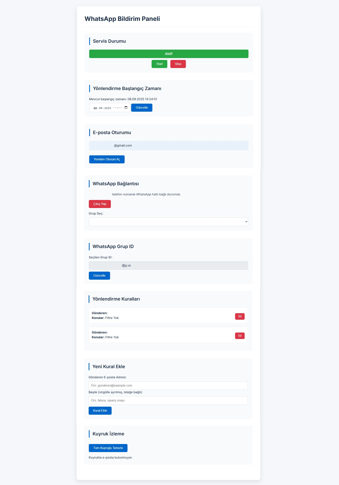

# Mail2Wp - E-posta'dan WhatsApp'a Mesaj Yönlendirici

Bu uygulama, belirtilen bir e-posta adresine gelen yeni e-postaları okur ve bu e-postaların içeriğini belirli WhatsApp gruplarına mesaj olarak gönderir.

## Genel Bakış

Mail2Wp, Gmail API'sini kullanarak e-postaları düzenli aralıklarla kontrol eder ve WhatsApp Web otomasyonu aracılığıyla istenen gruplara iletir. Servis, bir web arayüzü üzerinden yönetilebilir ve durumu hakkında bilgi alınabilir.



## Özellikler

- **Periyodik E-posta Kontrolü:** Belirtilen Gmail hesabını düzenli olarak kontrol ederek yeni e-postaları alır.
- **WhatsApp Entegrasyonu:** `whatsapp-web.js` kütüphanesi ile WhatsApp'a bağlanır ve mesaj gönderir.
- **Web Arayüzü:** Servisin durumunu (aktif/pasif), WhatsApp bağlantı durumunu ve QR kodunu gösteren basit bir ön yüz.
- **API Desteği:** Servisi yönetmek ve durumunu kontrol etmek için REST API uç noktaları.
- **Kuyruk Mekanizması:** E-postaların güvenilir bir şekilde işlenmesi için bir kuyruk yapısı kullanır.
- **Süreç Yönetimi:** `pm2` ile uygulamanın sürekli çalışması sağlanır.

## Kurulum ve Başlatma

1.  **Bağımlılıkları Yükleyin:**
    ```bash
    npm install
    ```

2.  **Google Cloud Projesi ve Gmail API'si:**
    - Google Cloud Platform'da bir proje oluşturun.
    - Gmail API'sini etkinleştirin.
    - OAuth 2.0 istemci kimliği ve sırlarını içeren `credentials.json` dosyasını projenin ana dizinine ekleyin.
    - `token.json` dosyası, ilk yetkilendirmeden sonra otomatik olarak oluşturulacaktır.

3.  **Uygulamayı Başlatma:**
    Uygulamayı geliştirme modunda çalıştırmak için:
    ```bash
    npm test
    ```
    Uygulamayı production ortamı için `pm2` ile başlatmak:
    ```bash
    pm2 start src/index.js --name mail2wp
    ```

4.  **WhatsApp Bağlantısı:**
    - Uygulama başlatıldığında, terminalde bir QR kodu görünecektir.
    - WhatsApp mobil uygulamanızdan **Ayarlar > Bağlı Cihazlar > Cihaz Bağla** menüsünü kullanarak bu QR kodunu okutun.
    - Bağlantı başarılı olduğunda, uygulama e-postaları yönlendirmeye hazır olacaktır.

## API Uç Noktaları

- `GET /api/status`: Servisin genel durumunu (WhatsApp bağlantısı, servis aktifliği vb.) döndürür.
- `GET /api/qrcode`: WhatsApp için yeni bir QR kodu oluşturur ve döndürür.
- `POST /api/start`: E-posta yönlendirme servisini başlatır.
- `POST /api/stop`: E-posta yönlendirme servisini durdurur.

## Kullanılan Teknolojiler

- [Node.js](https://nodejs.org/)
- [Express.js](https://expressjs.com/)
- [googleapis (Gmail API)](https://github.com/googleapis/google-api-nodejs-client)
- [whatsapp-web.js](https://github.com/pedroslopez/whatsapp-web.js)
- [node-cron](https://github.com/node-cron/node-cron)
- [PM2](https://pm2.keymetrics.io/)

## Lisans

Bu proje ISC lisansı altındadır. Detaylar için `LICENSE` dosyasına bakınız.
